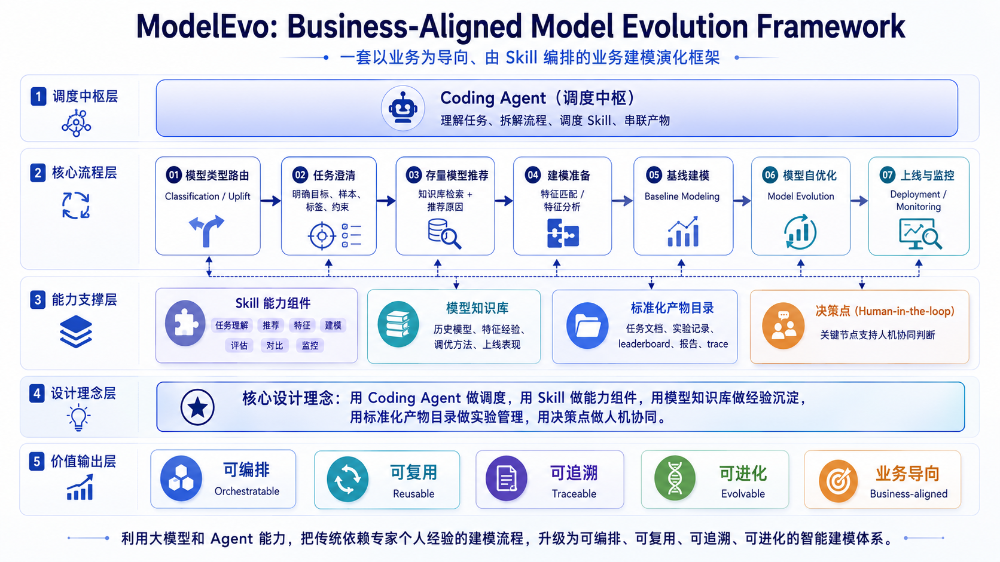

# Model Evo

**ModelEvo**: Business-Aligned Model Evolution Framework — 一套以业务为导向、基于 Skill 编排的业务建模演化框架。


**核心设计理念**: 用 Coding Agent 做调度，用 Skill 做能力组件，用模型知识库做经验沉淀，用标准化产物目录做实验管理，用决策点做人机协同。利用大模型和 Agent 能力把传统依赖专家个人经验的建模流程，升级为可编排、可复用、可追溯、可进化的智能建模体系。


##  🔥 News
- 【**2026. 07. 10**】发布V1.0版本，包含**建模智能化**（`model-skills/`），包含业务建模全流程 Skill 集合，覆盖从需求采集、样本准备、特征工程、模型开发、评估对比到归档沉淀的完整链路，支持 **classification（分类）** 与 **uplift（增益/因果）** 两种建模方式。**特征挖掘智能化**（`feature-mining-skills/`）仅做存在性说明，不在本次发布范围，待后续更新。

> **Status:** Public release (V1.0).<br>
> **Maintainers:** [奇富科技 / Qfin Holdings](https://github.com/QFIN-tech)<br>
> **Contact:** [dikiwixuan@gmail.com](mailto:dikiwixuan@gmail.com)

## 整体架构


```
                          ┌─────────────────────────────┐
   用户建模请求 ──────────▶│  model-task-routing         │  判定 classification / uplift
                          │  （模型方向路由 skill）       │
                          └───────┬──────────────┬───────┘
                                  │              │
                  classification  │              │  uplift
                                  ▼              ▼
                   classification-model-     uplift-model-
                   orchestration             task-spec
                                  │              │
                                  ▼              ▼
                    分类建模（见下）            uplift 建模
```
- `model-task-routing` 是唯一建模需求总入口，先判定任务类型，再进入对应建模类型的 `*-model-task-spec`。
- `model-knowledge` 作为共享知识库沉淀与复用建模经验（业务领域知识 / 特征资产 / 历史模型档案 / 建模经验）。


## 目录结构

```
model-evo/
├── model-skills/                            # 建模主流程 skill（本次发布主体）
│   ├── model-task-routing/                  # 模型方向路由（总入口，分流 classification/uplift）
│   ├── model-knowledge/                     # 模型知识库（跨流程共享）
│   ├── feature-matching/                    # 特征匹配（跨流程共享）
│   ├── feature-analysis/                    # 特征分析（跨流程共享）
│   │
│   ├── classification-model-orchestration/  # 分类建模编排（统筹分类全流程）
│   ├── classification-model-task-spec/      # 建模任务澄清 / 规格化 + 样本分析
│   ├── classification-model-recommend/      # 历史模型推荐
│   ├── classification-model-development/    # 模型开发总控（迭代式编排）
│   ├── classification-model-training/       # 模型训练（xgb / dnn / lr）
│   ├── classification-model-tuning/         # 模型调参 / 特征筛选
│   ├── classification-model-evaluation/     # 模型评估（单模型标准化评估）
│   ├── classification-model-comparison/     # 模型对比（多模型 N-way）
│   │
│   ├── uplift-model-task-spec/              # uplift 任务澄清 / 规格化（流程入口）
│   ├── uplift-model-sample-preparation/     # 样本切分方案 + 建模样本产物
│   ├── uplift-model-sample-homogeneity-check/ # treatment/control 同质性检查
│   ├── uplift-model-feature-quality-analysis/ # 特征质量诊断 + 筛选建议
│   ├── uplift-model-s-learner-modeling/     # S-Learner 建模
│   ├── uplift-model-t-learner-modeling/     # T-Learner 建模
│   ├── uplift-model-tuning/                 # uplift 调参
│   ├── uplift-model-result-comparison/      # uplift 模型对比
│   ├── uplift-model-reporting/              # uplift 最终报告
│   │
│   └── _uplift-common/                      # uplift 公共代码（project_layout / data_loader / io）
│
├── _modelevo-shared/                        # 跨 skill 公共代码（config_io / fetch_spark / 等）
│   ├── scripts/
│   └── tests/
│
├── examples/                                # 示例（公开数据集切片，可直接跑通全流程）
│   ├── model-classification-example1/       # 分类示例（Default of Credit Card Clients 公开数据集切片）
│   └── model-uplift-example1/               # uplift 示例（Criteo Uplift 公开数据集切片）
│
└── feature-mining-skills/                   # 特征挖掘 skill（占坑，早期阶段，本次不发布）
```

## 分类建模流程（classification）

由 `classification-model-orchestration` 统筹编排，主流程与执行层分工如下：

**主流程**（含人工/交互决策点）：

```
task-spec ─▶ model-recommend ─▶ [是否建模?]
                                     │ 是
                                     ▼
                            model-development ──▶ 归档至 model-knowledge
                                     ▲  │
                        (多轮迭代优化) │  ▼
                              tuning / comparison
```

**执行层 skill**（被主流程/编排调度）：

| Skill | 说明 |
|---|---|
| `feature-matching` | 特征匹配：从特征库检索并对齐候选特征（Spark 宽表取数或本地文件转写） |
| `feature-analysis` | 特征分析：基础统计 / IV+AUC / PSI 报告 + Train/Test/OOT 切分，仅产报告不自动剔特征 |
| `classification-model-training` | 模型训练（xgb / dnn / lr，八阶段产物，自动对齐历史 baseline） |
| `classification-model-tuning` | 模型调参（Optuna）/ 特征筛选（PSI/IV/缺失率），产 `-tuned` / `-feat` 新 run |
| `classification-model-evaluation` | 单模型标准化评估（AUC/KS/分桶排序性/业务指标 + 客群拆分，JSON+MD+XLSX） |
| `classification-model-comparison` | 多模型 N-way 横向对比（delta 分析与缺口清单） |


## Uplift 建模流程（uplift）

覆盖任务定义 → 样本准备 → 同质性检查 → 特征质量分析 → S/T-Learner 建模 → 调参 → 多模型对比 → 最终报告的完整链路：

| Skill | 说明 |
|---|---|
| `uplift-model-task-spec` | uplift 任务规格化（流程入口）：干预定义、目标增量、实验/对照组、样本主体、时间窗口、字段映射 |
| `uplift-model-sample-preparation` | 样本语义检查 + 切分方案 + 建模样本产物 |
| `uplift-model-sample-homogeneity-check` | treatment/control 协变量均衡性诊断 |
| `uplift-model-feature-quality-analysis` | 特征质量诊断（缺失率/Split PSI/Monthly PSI/Uplift Bivar）+ 筛选建议 |
| `uplift-model-s-learner-modeling` | S-Learner baseline 训练 |
| `uplift-model-t-learner-modeling` | T-Learner baseline 训练 |
| `uplift-model-tuning` | 基于 baseline 的 LightGBM learner 有边界调参 |
| `uplift-model-result-comparison` | 多模型/版本确定性比较 → 推荐模型 |
| `uplift-model-reporting` | 最终建模报告（MD + HTML + facts + manifest） |

## 共享 skill / 资产

| Skill / 资产 | 说明 |
|---|---|
| `model-task-routing` | 模型方向路由：在需求沟通中判定 classification / uplift 并分流（总入口） |
| `model-knowledge` | 模型知识库：沉淀业务领域知识、特征资产、历史模型档案与建模经验，供检索复用 |
| `feature-matching` | 特征匹配：从特征库检索并对齐候选特征（分类 / uplift 共用） |
| `feature-analysis` | 特征分析：质量评估与特征筛选辅助（分类 / uplift 共用） |
| `_modelevo-shared/scripts/` | 跨 skill 公共代码：`config_io`（配置读写 + 数据安全红线）/ `fetch_spark` / `gen_fetch_command` / `spark_defaults` |

## 关键依赖约定

- **路由在最前**：`model-task-routing` 是总入口，先判定任务类型，再进入对应流程的 `*-model-task-spec`。
- **命名前缀**：仅 classification 流程专属 skill 加 `classification-` 前缀，uplift 流程专属 skill 加 `uplift-` 前缀；跨流程共享 skill（`model-task-routing`、`model-knowledge`、`feature-matching`、`feature-analysis`）不加前缀。
- **`name` 字段与目录同名**：每个 `SKILL.md` 的 `name` 必须等于其所在目录名。


## 运行环境与前置依赖


### 基础环境

| 项 | 要求 |
|---|---|
| Python | 3.9+ |
| 操作系统 | Linux / macOS |
| Coding Agent | Claude Code / Codex / Trae / Qoder / WorkBuddy 等Coding Agent工具 |

### 大数据环境（可选）
**高阶用法才需要（参见下述场景三）**

`feature-matching` / `classification-model-task-spec` / `classification-model-recommend` 的 **spark 模式**依赖：

- Spark 3.x + YARN + HDFS 集群
- PySpark环境配置


### 安装


```bash
# 第一步：获取代码
git clone <repo-url> model-evo
cd model-evo

# 第二步：把 skill 安装到 Agent 的 skill 目录**（如 Claude Code 的 `~/.claude/skills`）
export SKILL_ROOT=~/.claude/skills
mkdir -p ${SKILL_ROOT}
cp -r  model-skills/* ${SKILL_ROOT}
cp -r  _modelevo-shared/ ${SKILL_ROOT}

# 第三步（可选）：如果要走spark模式，需要配置。
# cd ${SKILL_ROOT}/_modelevo-shared/
# 修改 scripts/spark_defaults.yaml 中的相关环境配置

```

### 其他接入说明（可选）
如果要使用高阶用法：参考下述示例**场景三：复用公司历史模型与特征资产**
需要修改知识库内容：具体修改参考[`model-skills/model-knowledge/README.md`](model-skills/model-knowledge/README.md)

---

## 使用说明 · 场景 Case 示例

ModelEvo 以 `model-task-routing` 为总入口。直接用自然语言描述建模诉求即可触发，无需手动指定 skill。下面给出几个典型场景。

### 两条可选接入路径

| 路径 | 取数方式 | 是否需要 Spark 集群 | 适合谁 |
|---|---|---|---|
| **A. 本地文件模式（推荐首跑）** | 直接读本地 parquet/csv | ❌ 不需要 | 想快速验证流程、手头已有含特征+标签的样本文件 |
| **B. Spark 集群模式（生产取数）** | 从数仓宽表拉取 | ✅ 需要 Spark 3.x + YARN + HDFS | 样本与特征在数仓里、需规模化取数的生产团队 |

**强烈建议先走路径 A 跑通全流程**，再扩展到路径 B。以下场景一和场景二都是本地模式，场景三为集群模式

### 场景一：本地分类样本跑通分类全流程

**适用**：手头已有一份含特征+标签的本地 parquet/csv，想快速跑通「特征分析 → 训练 → 评估 → 对比」。

**步骤**：

1. 准备样本（参考 [`examples/model-classification-example1/`](examples/model-classification-example1/)，Default of Credit Card Clients 公开数据集切片）。
2. 在对话中输入：

      ```
      > 基于本地 data/sample.parquet 进行分类建模
      ```

3. `model-task-routing` 一次性抛出 Q1/Q2/Q3（预测目标 / 是否有干预 / 是否有实验组），回复后判定为 classification。
4. 流程自动走 `local_file` 模式取数 → 特征分析 → baseline 训练 → 评估，产物落到 `runs/{时间戳}-{模型名}/`。
5. 在 `development` 的 Stage 2 决策点选择「调参 / 特征筛选 / 换算法」迭代，最终在 `model-comparison/` 看多版本横向对比。

**产物**：`runs/.../new-models/xgb-v1/evaluation/`（AUC/KS/分桶排序性 JSON+MD+XLSX）、`runs/.../model-comparison/`（多路对比）。


### 场景二：本地Uplift 增益建模（发券/触达是否值得）

**适用**：关心「对谁干预能带来增量」，而非「谁会发生结果」。例：发券后核销提升、外呼后动支提升。示例数据见 [`examples/model-uplift-example1/`](examples/model-uplift-example1/)（Criteo Uplift 公开数据集切片）。

**步骤**：

1. 输入诉求：

      ```
      > 我想做一个 uplift 模型，评估发券对不同用户的核销增量效果，有实验/对照组数据
      ```

2. `model-task-routing` 判定 Q2=有干预、Q3=有实验组 → `task_type=uplift`，路由到 `uplift-model-task-spec`。
3. 依次走：样本准备 → 同质性检查（treatment/control 是否可比）→ 特征质量分析 → S-Learner / T-Learner 建模 → 调参 → 多模型对比 → 最终报告。
4. `uplift-model-result-comparison` 给出推荐模型，`uplift-model-reporting` 产出 MD + HTML 报告。

**产物**：`new-models/{experiment_id}/`（如 `new-models/exp-001-s_learner_baseline/`）下的模型元数据、raw/normalized AUUC、uplift 分箱、打分表、特征重要性。

### 场景三：复用公司历史模型与特征资产（依赖spark环境/知识库内容适配）

**适用**：针对业务建模大部分场景，新需求与某历史模型相似，想复用历史模型/特征/算法/参数。

**步骤**：

1. `classification-model-recommend` 从 `model-knowledge` 的模型台账 `model_catalog.csv` 检索可复用模型，规则召回 + 语义排序 + 适配度评估。
2. 命中则委托 `classification-model-evaluation` 产三档评估，作为新模型 baseline 对齐基准。
3. 新模型训练时自动与历史 baseline 做 AUC/KS/分档 delta 对比。

### 场景四：断点续跑历史任务

**适用**：上次建模中途断了，想接着跑。

**步骤**：

1. 新会话启动时，`classification-model-orchestration` 自动扫描 `runs/` 下最近 5 个 session，按 `_manifest.json` 推断进度。
2. 列表询问「选历史序号续跑 / 新建」，选定后从断点阶段继续，不重跑已完成阶段。

### 场景五：直接调用单个 Skill

已知上下文时也可跳过路由直接调单个 skill，例如：

```
> 对 sample.parquet 做特征分析        # → feature-analysis
> 对 evaluation 目录下的多个模型做横向对比   # → classification-model-comparison
> 我想判断这两组数据是否同质/可比        # → uplift-model-sample-homogeneity-check
```

